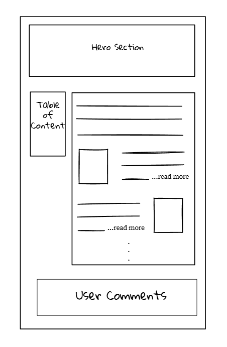

# Approach

1. Build static blog site using Nuxt and **tailwind** with hard coded sample data (UI preparation)
2. Create database using **supabase** to store relevant data for blog
3. Use **Prisma** to connect database with backend
4. backend (**typescript**) to serve data using **tRPC** on request from frontend
5. Deploy to a hosting provider

# UI wireframe

